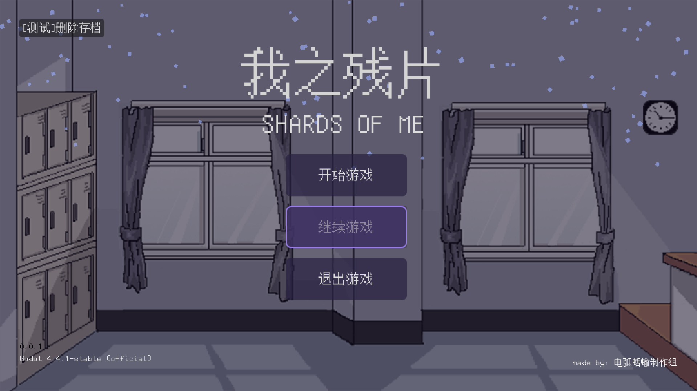
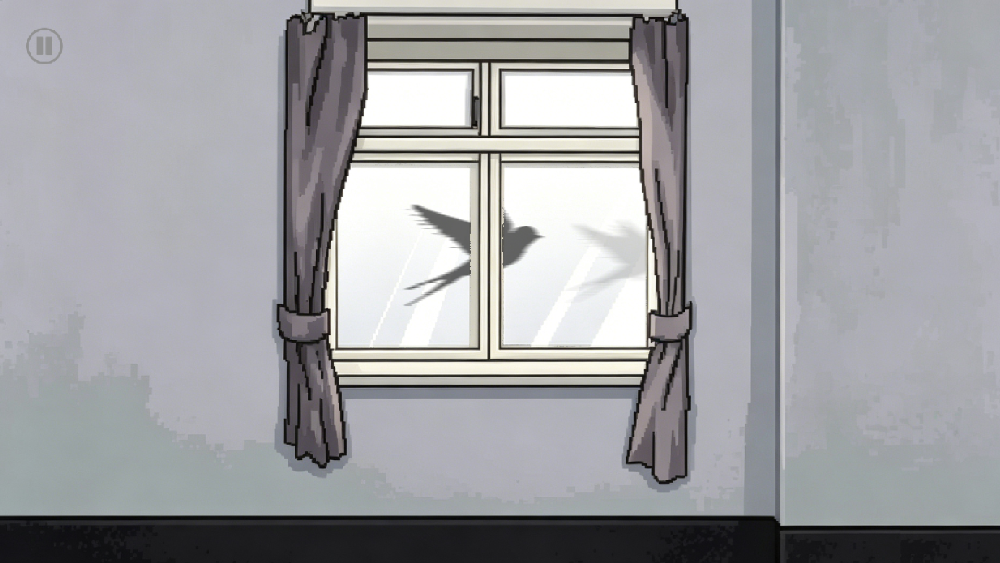
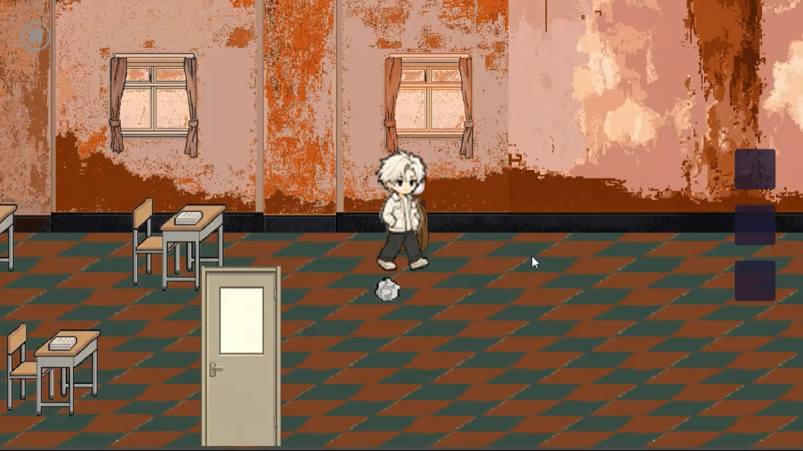
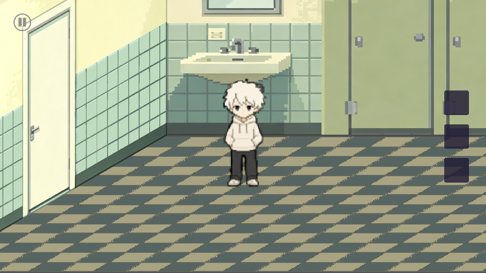
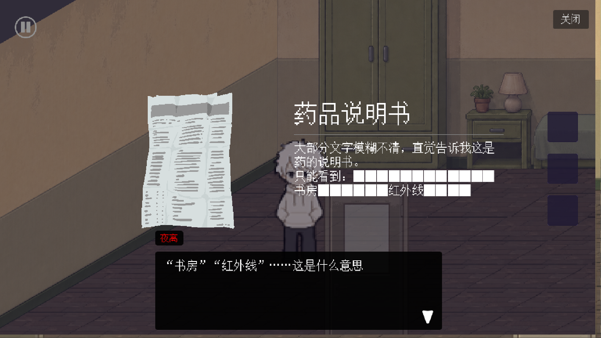
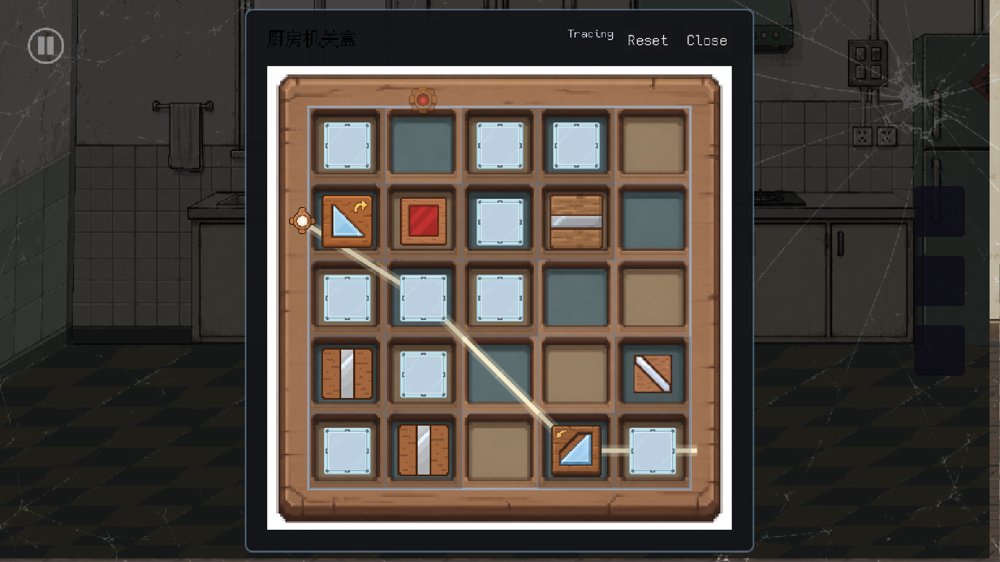
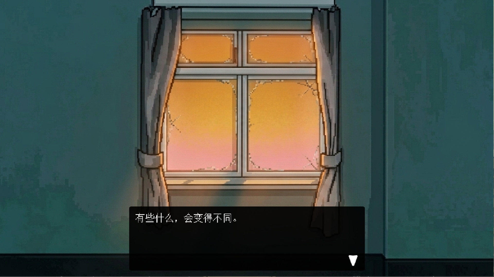

# 《我之残片》

2026年网易游戏高校MINI GAME挑战赛参赛作品。

## 游戏类型

解谜；冒险

## 一句话简介
一部关于迷惘、自我对话与继续前行的短篇心理叙事解谜游戏。

## 游戏截图

## 核心玩法
- **表里世界切换**：在正常校园/家庭场景与破碎的内心世界之间切换，同一场景在不同状态下呈现不同线索
- **场景探索**：通过观察环境、收集物品、与物件互动来推进剧情
- **谜题驱动**：解谜不是目的，而是接近故事真相的手段

## 核心体验
可玩性：游戏采用表里世界切换与场景探索相结合的玩法，玩家需要通过观察环境、收集线索和解开谜题来推动剧情发展。

目标：探索、解谜、推动剧情，与角色一同完成一趟独特的旅程。

节奏设计：
- 序章：悬念建立
- 第一章：探索解谜
- 第二章：情感收束

## 世界观与美术
- **题材**：现代校园与家庭生活背景
- **美术风格**：2D像素，融合温馨与破败两种质感
- **氛围**：安静、克制、带着一点淡淡的疏离感

## 目标用户
剧情向游戏玩家。

偏好：
- 重视剧情体验而非操作挑战
- 喜欢探索角色内心世界
- 愿意阅读对话与独白
- 喜欢开放式结局和留白叙事

## 成员分工
1. 主策划      [无夜](https://github.com/Non-night)
2. 程序策划    [和泉屋](https://github.com/xcyhjn)
3. 主程序/PM   [緋雲(Essenpphire)](https://github.com/Essenpphire)
4. 谜题        [StelleZetex](https://github.com/Sky-Meteor)
5. UI          [栎安](https://github.com/nonrelian)
6. 立绘美术     长草绿石像
7. 物品美术     Reko
8. 配乐        查拉图斯特拉(kiiye9697)
